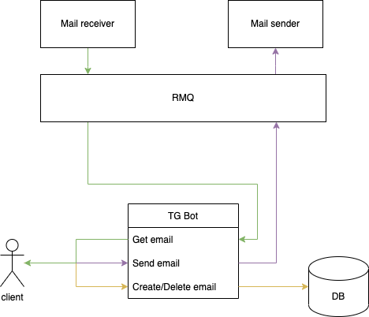

# Pigeomail

- Service which provides securely personal email addresses written in pure Go.
- Using this service, through our telegram bot, one can create an email, receive incoming emails.
- Currently you can only recieve emails, but in future we will add sending emails via the bot as well
- We don't store the emails in the server, but we will keep them in rmq until the user opens the bot to receive those emails.

# Setting up the project locally:

Step 1: Take a copy of your config from default config (in .deploy folder)

``` cp config.dev.yaml config.yaml ```

Step 2: Up the required containers( docker-compose located in .deploy folder)

``` docker-compose.yml up ```

Step 3: Generate token from telegram by creating a bot, using @BotFather (https://t.me/botfather)

https://docs.microsoft.com/en-us/azure/bot-service/bot-service-channel-connect-telegram?view=azure-bot-service-4.0 

Step 4: Build the project

``` go build -o pigeomail main.go ```

Step 5: launch the services: We have two services receiver( to get incoming mail) and tg_bot (to interact with telegram bot API)

``` ./pigeomail receiver -c .deploy/config.yaml ```

``` ./pigeomail tg_bot -c .deploy/config.yaml ```

## Scheme

